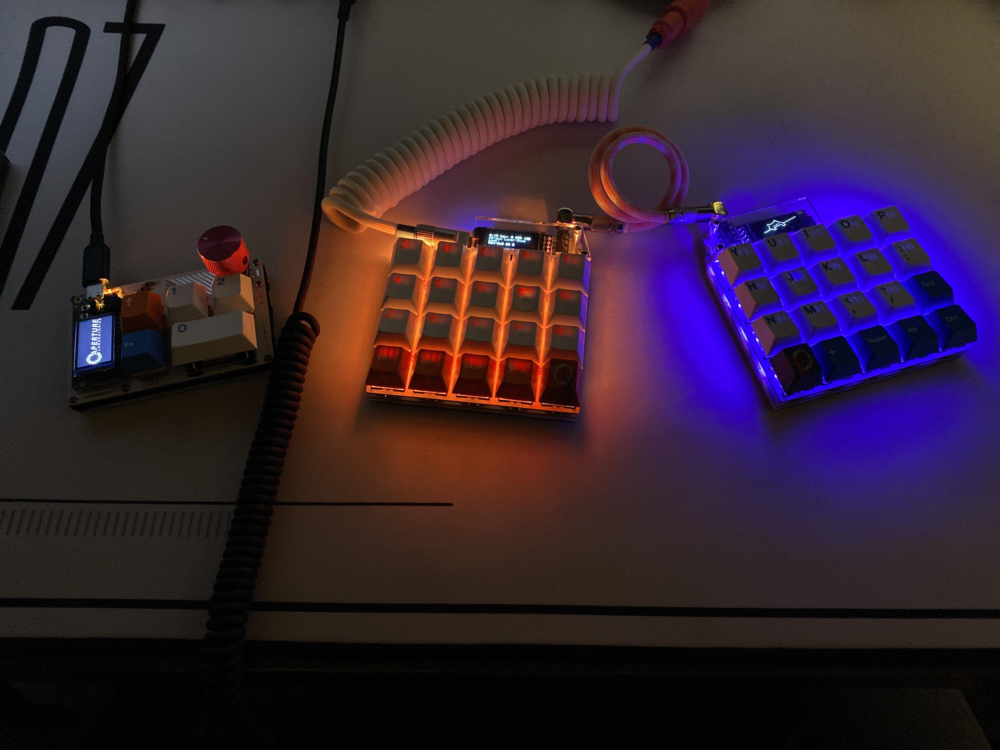

# Rhymestone Config

This is just a repository in order to save my own personal config for the [Rhymestone](https://github.com/marksard/Keyboards?tab=readme-ov-file#rhymestone)


## Keymap

### Layers
Layer | Description
------|-------------
BASE  | Layer for regular typing and navigating.
LOWER | Modifier layer and additional action keys.
RAISE | Additional text layer.
ADJUST| Layer for meta actions and mouse keys.

### Custom keys
Symbol | Description
-------|-------------
LOW    | Go to Lower layer.
HIG    | Go to higher layer.
CMM    | Single tap produces `,`, double tap `.`
ZSF    | Single tap or double tap produces `z`, Holding produces `<Shift>`.
SSF    | Single tap or double tap produces `;`, Holding produces `<Shift>`.
TSF    | Single tap or double tap produces `<Tab>` Holding produces `<Shift>`.
MAC    | Puts modifiers in order of `CTL`, `ALT`, `CMD`.
WIN    | Puts modifiers in order of `ALT`, `CMD`, `CTL` (i like having `CTL` and `ALT` switched on windows).
RGB_T  | Toggle RGB.
RGB_M  | Cycle through RGB modes.
RGB_P  | Enable Portal RGB lighting.
ACC_X  | Set mouse acceleration.
BTNX   | Mouse button x.
MS_X   | Move mouse in direction.
WH_X   | Mouse wheel in direction.
BOOT   | QMK Reboot.
       | Empty will have the same key as previous layer.
✖      | Unassigned, will do nothing.

> To get to the ADJUST layer you will have to hold `LOW` and `HIG` together.

### Layout
```
Base
,-----------------------------.     ,-----------------------------.
|  Q  |  W  |  E  |  R  |  T  |     |  Y  |  U  |  I  |  O  |  P  |
|  A  |  S  |  D  |  F  |  G  |     |  H  |  J  |  K  |  L  | SSF |
| ZSF |  X  |  C  |  V  |  B  |     |  N  |  M  | CMM |  UP |ENTER|
| CTL | ALT | CMD | LOW | SPC |     | BSP | HIG | LEFT| DOWN|RIGHT|
`-----------------------------'     `-----------------------------'

Lower
,-----------------------------.     ,-----------------------------.
|  !  |  @  |  #  |  $  |  %  |     |  ^  |  &  |  *  |  (  |  )  |
| ESC |  F3 |  F2 |  F3 |  ✖  |     |  -  |  =  |  [  |  ]  |  '  |
| TSF |  F4 |  F5 |  F6 |  ✖  |     | DEL |  ✖  |  ✖  |  /  |     |
|     |     |     |     |     |     |     |     |     |     |     |
`-----------------------------'     `-----------------------------'

Raise
,-----------------------------.     ,-----------------------------.
|  1  |  2  |  3  |  4  |  5  |     |  6  |  7  |  8  |  9  |  0  |
|  `  |  F7 |  F8 |  F9 |     |     |     |     |     |     |  \  |
| TSF |  F10|  F11|  F12|     |     |     |     |     |     |     |
|     |     |     |     |     |     |     |     |     |     |     |
`-----------------------------'     `-----------------------------'

Adjust
,-----------------------------.     ,-----------------------------.
| BOOT|  ✖  |  ✖  |  ✖  |  ✖  |     | BTN4| BTN3| BTN5| WH_U|  ✖  |
|RGB_T|ACC_0|ACC_1|ACC_2|RGB_P|     | BTN1| MS_U| BTN2| WH_D|  ✖  |
|RGB_M|  ✖  |  ✖  |  ✖  |  ✖  |     | MS_L| MS_D| MS_R|  ✖  |     |
|     | MAC | WIN |     |     |     |     |     |     |     |     |
`-----------------------------'     `-----------------------------'

```
## How to install
Install the QMK Firmware https://github.com/qmk/qmk_firmware

Then clone this repository into the correct place like so
```
# presumed to be in the qmk firmware directory
git clone https://github.com/meir/rhymestone-config ./keyboards/marksard/rhymestone/keymaps/meir
```

And then compile and flash
```
qmk compile -c -kb marksard/rhymestone -km meir
qmk flash -kb marksard/rhymestone -km meir
```

If you have a blok controller, add `-e CONVERT_TO=blok` to the compile command.

